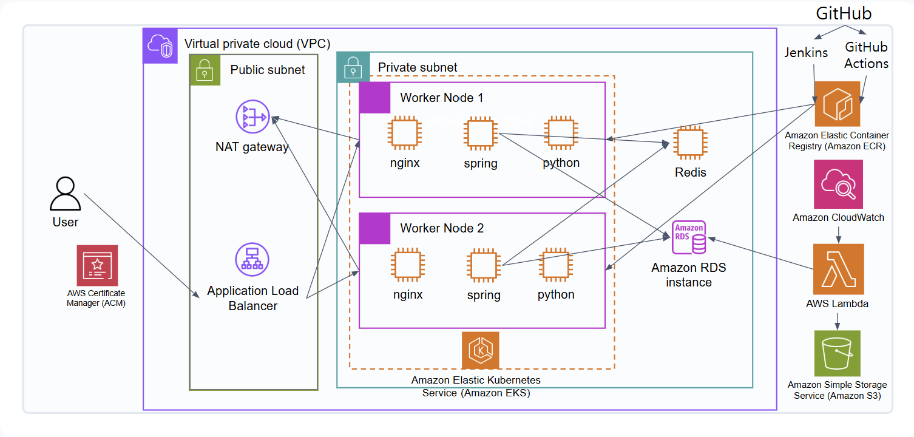

# Hospital ERP

예약부터 접수, 진료까지 이어지는 병원 업무 프로세스를 구현하고,
AI 진단 보조 기능과 AWS EKS 기반 컨테이너 배포 환경을 적용한 병원 ERP 시스템입니다.

---

# 1. 프로젝트 소개

Hospital ERP는 병원의 예약, 접수, 진료, 수납 업무를 하나의 시스템으로 관리하기 위해 개발한 팀 프로젝트입니다.

환자, 의료진, 원무과 등 사용자 역할에 따라 기능과 의료정보 접근 권한을 구분하고, 실제 병원 업무 흐름인 **예약 → 확정 → 접수 → 진료** 프로세스를 구현했습니다.

또한 단순한 CRUD 구현에 그치지 않고,

- AI 기반 진단 보조
- AI 의료진 근무 스케줄 자동 배치
- AI 병원 문의 챗봇
- Redis 기반 예약 동시성 제어
- SSE + Redis Pub/Sub 기반 실시간 알림
- Elasticsearch 기반 진료기록 검색

등 실제 서비스 운영을 고려한 기능을 구현했습니다.

애플리케이션은 Docker 기반 컨테이너로 구성하였으며, AWS EKS 환경에 배포하여 클라우드 기반 실행 환경을 구축했습니다.

| 구분 | 내용 |
| --- | --- |
| 개발 기간 | 2026.03.30 ~ 2026.05.06 |
| 개발 인원 | 3명 |
| 프로젝트 형태 | 팀 프로젝트 |
| 주요 기술 | Spring Boot · React · FastAPI · Redis · Elasticsearch · Docker · Kubernetes · AWS EKS |

---

# 2. 팀 구성 및 담당 역할

프로젝트 기획과 Database 설계, 인증 및 배포 등 공통 영역은 함께 진행하고, 이후 주요 도메인을 분담하여 개발했습니다.

## 팀 구성

| 이름 | 역할 | 담당 영역 |
| --- | --- | --- |
| **송한솔** | **팀장** | 예약·접수·진료 프로세스, AI 진단 보조, Redis/SSE, Elasticsearch, 감사 로그, AWS EKS |
| 송가연 | 팀원 | 직원·부서 관리, 수술 및 근무 스케줄, AI 자동 스케줄링, CloudWatch |
| 유지원 | 팀원 | OAuth2 로그인, 환자 기능, 실시간 채팅, AI 챗봇, 결제·수납, CI/CD |

## 담당 역할 (송한솔)

### 프로젝트 기획

- 프로젝트 기획 및 Database 설계
- 팀장 역할 수행
- UI 설계
- Git 기반 형상 관리

### Backend

- 예약 → 확정 → 접수 → 진료 프로세스 구현
- Redis 기반 예약 동시성 제어
- SSE + Redis Pub/Sub 기반 실시간 예약 알림
- Elasticsearch 기반 진료기록 검색
- JWT + Spring Security 기반 인증/인가
- AOP 기반 의료정보 접근 감사 로그
- 근무 스케줄 상세 카드 구현

### AI

- AI 진단 보조 기능 구현
- Spring Boot ↔ FastAPI 서비스 연동
- FAISS 기반 유사 진료기록 검색
- LLM 기반 추가 진료과 판단 및 진단 보조 결과 생성

### AWS / DevOps

- Docker 기반 컨테이너화
- Amazon ECR 이미지 관리
- Amazon EKS + ALB 기반 서비스 배포
- Rolling Update 전략 적용
- Lambda 기반 감사 로그 백업

---

# 3. 주요 기능

## 예약 / 접수 / 진료

- 환자 진료 예약
- 예약 확인 및 담당 의료진 배정
- 예약 확정 및 접수
- 의료진 진료 및 진료기록 작성
- 예약 확정 시 담당 의료진 실시간 알림

## 직원 / 근무 스케줄

- 직원 및 부서 관리
- 직원 일괄 등록
- 의료진 근무 일정 관리
- 수술 스케줄 관리
- 부서별 근무 정책 관리
- AI 기반 근무 스케줄 자동 생성

## AI

- 환자의 과거 진료기록 기반 AI 진단 보조
- 관련 진료과 추천
- LangGraph 기반 병원 문의 챗봇

## 환자 / 수납

- 회원가입 및 마이페이지
- Toss Payments 기반 진료비 결제
- 수납 및 결제 내역 관리

## 검색 / 실시간 기능

- Elasticsearch 기반 진료기록 검색
- SSE + Redis Pub/Sub 기반 실시간 예약 알림
- WebSocket/STOMP 기반 직원 간 채팅
- S3 기반 채팅 파일 관리

## 인증 / 보안

- JWT + Spring Security 기반 인증/인가
- Naver / Kakao OAuth 로그인
- 담당 의료진 기반 의료정보 접근 제어
- AOP 기반 의료정보 접근 감사 로그

## Cloud / DevOps

- Docker 기반 컨테이너 배포
- Amazon ECR 이미지 관리
- Amazon EKS + ALB 기반 서비스 운영
- Jenkins + GitHub Actions 기반 CI/CD
- CloudWatch 모니터링
- Lambda + Amazon S3 기반 로그 백업

# 4. 기술 스택

## Backend

- Java 17
- Spring Boot 3.5.12
- Spring Security
- Spring Data JPA
- Spring WebSocket
- JWT
- Redisson

## Frontend

- React
- Vite
- Axios
- TanStack Query
- Redux Toolkit
- STOMP
- EventSource Polyfill

## AI

- Python 3.11
- FastAPI
- LangChain
- LangGraph
- OpenAI API
- FAISS
- ChromaDB

## Database / Cache / Search

- MySQL
- Amazon RDS
- Redis
- Elasticsearch

## Infrastructure / DevOps

- Docker
- Nginx
- Kubernetes
- Amazon EKS
- Amazon ECR
- Amazon ALB
- Amazon S3
- Amazon CloudWatch
- AWS Lambda
- Jenkins
- GitHub Actions

## External API

- Toss Payments
- Naver OAuth
- Kakao OAuth

## Collaboration

- Git
- GitHub

---

# 5. 시스템 아키텍처


## 시스템 구성

본 프로젝트는 **React**, **Spring Boot**, **FastAPI**를 분리한 구조로 구성했습니다.

React는 사용자 인터페이스를 제공하며, 모든 요청은 Spring Boot Backend를 통해 처리됩니다. Backend는 인증, 예약·접수·진료 프로세스와 같은 핵심 비즈니스 로직을 담당하며, MySQL(RDS)에 데이터를 저장합니다.

Redis는 예약 동시성 제어와 SSE 기반 실시간 알림 처리에 활용했고, Elasticsearch를 통해 진료기록 검색 기능을 제공했습니다.

AI 진단 보조 기능은 별도의 FastAPI 서비스로 분리했습니다. Spring Boot가 AI 진단 요청을 전달하면 FastAPI는 환자의 진료기록을 조회하고, FAISS 기반 유사도 검색과 LLM을 활용하여 진단 보조 결과를 생성한 뒤 Backend로 반환합니다.

서비스를 분리함으로써 병원 업무 로직과 AI 처리 로직의 책임을 구분하고, Python 생태계의 AI 라이브러리를 독립적으로 활용할 수 있도록 구성했습니다.

---

## 구성 요소

| 구성 요소 | 역할 |
| --- | --- |
| React Frontend | 사용자 인터페이스 및 Backend API 호출 |
| Spring Boot | 인증, 예약·접수·진료 등 핵심 비즈니스 로직 처리 |
| FastAPI | AI 진단 보조 및 LLM 연동 |
| Amazon RDS | 사용자·예약·진료기록 저장 |
| Redis | 예약 동시성 제어 및 실시간 이벤트 처리 |
| Elasticsearch | 진료기록 검색 |
| OpenAI API | AI 진단 보조 결과 생성 |

---

# 6. Database Design

프로젝트의 전체 ERD입니다.



병원의 실제 업무 흐름인 **예약 → 접수 → 진료 → 수납** 프로세스를 중심으로 Database를 설계했습니다.

또한 의료진과 환자의 담당 관계를 기반으로 진료기록 접근 권한을 관리할 수 있도록 관계를 구성했으며, 근무 스케줄, 채팅, AI 기능 등은 독립된 도메인으로 분리하여 관리하도록 설계했습니다.

---

## 설계 포인트

### 역할 기반 사용자 관리

- 사용자, 직원, 권한 정보를 분리하여 역할 기반 접근 제어(RBAC)를 적용했습니다.

### 병원 업무 프로세스 반영

- 예약 → 접수 → 진료 → 수납으로 이어지는 업무 흐름을 중심으로 테이블 관계를 설계했습니다.

### 의료정보 접근 제어

- 담당 의료진과 환자의 관계를 연결하여 담당 의료진만 진료기록을 조회할 수 있도록 구성했습니다.

### 도메인 분리

- 예약
- 진료
- 근무 스케줄
- 채팅
- AI

각 기능을 독립적인 도메인으로 구성하여 유지보수성과 확장성을 고려했습니다.

# 7. 주요 구현

## 7.1 예약 → 확정 → 접수 → 진료 프로세스

병원의 실제 업무 흐름인 **예약 → 확정 → 접수 → 진료** 과정을 하나의 프로세스로 구현했습니다.

환자가 예약을 신청하면 원무과에서 예약을 확인하여 담당 의료진과 진료 일정을 지정하고 예약을 확정합니다. 예약이 확정되면 접수 정보가 자동으로 생성되며, 이후 접수와 진료 단계로 상태가 순차적으로 변경됩니다.

또한 예약 확정 시 담당 의료진과 환자를 연결하여 **담당 의료진만 해당 환자의 진료기록을 조회할 수 있도록 접근 권한을 관리**했습니다.

### 주요 구현

- 예약 → 확정 → 접수 → 진료 상태 관리
- 담당 의료진 배정 및 진료 슬롯 관리
- 담당 의료진 기준 환자 조회
- 예약 확정 시 접수 데이터 자동 생성

---

## 7.2 Redis 기반 예약 동시성 제어

동일한 의료진의 동일 시간대에 여러 예약 요청이 동시에 발생하면 중복 예약이 생성될 수 있습니다.

이를 해결하기 위해 Redis 기반 분산 락을 적용하여 하나의 요청만 예약을 수행하도록 구현했습니다.

EKS 환경에서는 여러 애플리케이션 인스턴스가 동시에 요청을 처리하기 때문에 JVM 내부 Lock만으로는 동시성을 제어할 수 없습니다. 따라서 Redis를 공유 Lock 저장소로 사용하여 모든 인스턴스가 동일한 Lock을 획득하도록 구성했습니다.

Redisson의 `RLock`과 AOP를 활용하여 **의료진 ID + 예약 시간**을 기준으로 Lock Key를 생성하고, Lock을 획득한 요청만 예약 확정 로직을 수행하도록 구현했습니다.

### 주요 구현

* Redis(Redisson) 기반 분산 락
* AOP 기반 Lock 처리
* 의료진 ID + 예약 시간 기준 Lock Key 생성
* 동일 시간대 중복 예약 방지
* 락 획득 실패 및 인터럽트 예외 처리
* 현재 스레드가 소유한 락만 해제

### 핵심 코드

예약 확정 메서드에 `@DistributedLock`을 적용하고, SpEL 표현식을 이용해 의료진 ID와 예약 시간을 조합한 Lock Key를 생성했습니다.

```java
@DistributedLock(
        key = "#reservationDto.doctorId + ':' + #reservationDto.reservationDate"
)
public Integer reservationConfirmed(ReservationDto reservationDto) {
    Reservation reservation = reservationRepository
            .findById(reservationDto.getReservationId())
            .orElseThrow(() -> new RuntimeException("Not exist"));

    Staff staff = staffRepository
            .findById(reservationDto.getDoctorId())
            .orElseThrow(() -> new RuntimeException("Not exist"));

    Slot slot = slotRepository
            .findByStartTimeAndStaff(
                    reservationDto.getReservationDate(),
                    staff
            )
            .orElseGet(() -> createSlot(reservationDto, staff));

    slot.setCurrentPatient(slot.getCurrentPatient() + 1);

    reservation.setStaff(staff);
    reservation.setSlot(slot);
    reservation.setStatus(ReservationStatus.CONFIRMED);

    reservationRepository.save(reservation);

    return reservation.getReservationId();
}
```

커스텀 어노테이션이 적용된 메서드를 AOP에서 가로채고, Redisson의 `RLock`을 이용해 분산 락을 획득한 뒤 실제 비즈니스 로직을 실행합니다.

```java
@Around("@annotation(com.example.demo.reservation.redis.DistributedLock)")
public Object lock(ProceedingJoinPoint joinPoint) throws Throwable {
    MethodSignature signature =
            (MethodSignature) joinPoint.getSignature();

    Method method = signature.getMethod();
    DistributedLock annotation =
            method.getAnnotation(DistributedLock.class);

    String lockKey = LOCK_PREFIX + parseKey(
            annotation.key(),
            signature.getParameterNames(),
            joinPoint.getArgs()
    );

    RLock lock = redissonClient.getLock(lockKey);
    boolean acquired = false;

    try {
        acquired = lock.tryLock(
                annotation.waitTime(),
                annotation.leaseTime(),
                annotation.timeUnit()
        );

        if (!acquired) {
            throw new LockAcquisitionFailedException(lockKey);
        }

        return joinPoint.proceed();
    } catch (InterruptedException e) {
        Thread.currentThread().interrupt();
        throw new IllegalStateException(
                "락 처리 중 인터럽트 발생",
                e
        );
    } finally {
        if (acquired && lock.isHeldByCurrentThread()) {
            lock.unlock();
        }
    }
}
```

SpEL로 전달된 Lock Key 표현식을 실제 메서드 인자 값으로 변환하여 모든 서버 인스턴스가 동일한 Redis Lock Key를 사용하도록 구성했습니다.

```java
private String parseKey(
        String keyExpression,
        String[] paramNames,
        Object[] args
) {
    StandardEvaluationContext context =
            new StandardEvaluationContext();

    for (int i = 0; i < paramNames.length; i++) {
        context.setVariable(paramNames[i], args[i]);
    }

    return parser.parseExpression(keyExpression)
            .getValue(context, String.class);
}
```

### 적용 이유

예약 서비스 내부에서 직접 락을 획득하고 해제할 경우 비즈니스 로직과 동시성 제어 코드가 섞이게 됩니다.

이를 방지하기 위해 커스텀 어노테이션과 AOP를 사용하여 락 처리 책임을 별도의 공통 로직으로 분리했습니다. 예약 메서드에서는 Lock Key만 선언하고, 락 획득·대기·해제와 예외 처리는 AOP가 담당하도록 구성했습니다.

또한 `finally` 블록에서 락 획득 여부와 현재 스레드의 락 소유 여부를 확인한 뒤 해제하여, 다른 요청이 획득한 락을 잘못 해제하지 않도록 처리했습니다.

> 전체 코드
> [`ReservationService.java`](backend/src/main/java/com/example/demo/reservation/service/ReservationService.java)
> [`DistributedLock.java`](backend/src/main/java/com/example/demo/reservation/redis/DistributedLock.java)
> [`DistributedLockAop.java`](backend/src/main/java/com/example/demo/reservation/redis/DistributedLockAop.java)


---

## 7.3 SSE + Redis Pub/Sub 기반 실시간 알림

예약이 확정되면 담당 의료진에게 예약 정보를 실시간으로 전달하기 위해 SSE(Server-Sent Events)를 적용했습니다.

다중 인스턴스 환경에서도 정상적으로 이벤트를 전달하기 위해 Redis Pub/Sub을 사용하여 예약 확정 이벤트를 모든 서버에 공유하도록 구성했습니다.

또한 브라우저 기본 EventSource는 Authorization Header를 지원하지 않아 JWT 인증이 불가능했습니다. 이를 해결하기 위해 **event-source-polyfill**을 적용하여 기존 JWT 인증 방식을 그대로 유지하도록 구현했습니다.

```text
예약 확정
      │
Transaction Commit
      │
Redis Publish
      │
Redis Subscribe
      │
SSE Event 전송
      │
담당 의료진 알림
```

### 주요 구현

* SSE 기반 실시간 예약 알림
* Redis Pub/Sub 기반 이벤트 전달
* 트랜잭션 커밋 이후 이벤트 발행
* JWT 기반 SSE 인증
* EventSource Polyfill 적용
* 다중 인스턴스 환경에서의 실시간 이벤트 공유

### 핵심 코드

예약 확정 트랜잭션이 정상적으로 커밋된 이후에만 이벤트를 Redis로 발행하도록 `@TransactionalEventListener`를 적용했습니다.

```java
@TransactionalEventListener(phase = TransactionPhase.AFTER_COMMIT)
public void handleReservationConfirmed(
        ReservationConfirmedEvent event
) {
    redisPublisher.publish(
            event.getDoctorId(),
            event.getData()
    );
}
```

트랜잭션 커밋 전에 알림을 전송하면 예약 처리에 실패했음에도 사용자에게 알림이 전달될 수 있습니다. 이를 방지하기 위해 `AFTER_COMMIT` 시점에만 Redis Publish가 실행되도록 구성했습니다.

Redis Publisher는 담당 의료진 ID와 예약 데이터를 JSON으로 변환한 뒤 공통 채널에 발행합니다.

```java
public void publish(Integer doctorId, Object data) {
    try {
        String message = objectMapper.writeValueAsString(
                Map.of(
                        "doctorId", doctorId,
                        "data", data
                )
        );

        redisTemplate.convertAndSend(
                "reservation",
                message
        );
    } catch (Exception e) {
        throw new RuntimeException(e);
    }
}
```

각 애플리케이션 인스턴스는 동일한 Redis 채널을 구독하고, 수신한 메시지에서 담당 의료진 ID와 예약 데이터를 추출합니다.

```java
public void subscribe(String message) {
    try {
        Map<String, Object> event =
                objectMapper.readValue(message, Map.class);

        Integer doctorId =
                (Integer) event.get("doctorId");

        Object data = event.get("data");

        sseService.sendNewReservation(
                doctorId,
                data
        );
    } catch (Exception e) {
        e.printStackTrace();
    }
}
```

Redis에서 이벤트를 수신한 서버는 현재 인스턴스에 연결된 담당 의료진의 `SseEmitter`를 조회하여 예약 확정 이벤트를 전송합니다.

```java
public void sendNewReservation(
        Integer doctorId,
        Object data
) {
    SseEmitter emitter = emitters.get(doctorId);

    if (emitter == null) {
        return;
    }

    try {
        emitter.send(
                SseEmitter.event()
                        .name("newReservation")
                        .data(data)
        );
    } catch (Exception e) {
        emitters.remove(doctorId);
    }
}
```

프론트엔드에서는 기본 `EventSource` 대신 `event-source-polyfill`을 사용하여 SSE 연결 요청에 JWT Authorization Header를 포함했습니다.

```javascript
const eventSource = new EventSourcePolyfill(
    `${API_URL}/api/sse/subscribe`,
    {
        headers: {
            Authorization: `Bearer ${accessToken}`,
        },
        heartbeatTimeout: 120000,
        withCredentials: true,
    }
);

eventSource.addEventListener(
    "newReservation",
    (event) => {
        const reservation = JSON.parse(event.data);

        setNotifications((prev) => [
            reservation,
            ...prev,
        ]);
    }
);
```

### 적용 이유

SSE 연결 정보인 `SseEmitter`는 각 애플리케이션 인스턴스의 메모리에서 관리됩니다.

따라서 예약 확정 요청을 처리한 서버와 담당 의료진이 SSE로 연결된 서버가 서로 다르면, 단일 인스턴스 내부 이벤트만으로는 알림을 전달할 수 없습니다.

이를 해결하기 위해 예약 확정 이벤트를 Redis Pub/Sub으로 모든 서버 인스턴스에 전달하고, 각 서버가 자신에게 연결된 담당 의료진의 SSE 연결을 확인하여 이벤트를 전송하도록 구성했습니다.

또한 예약 트랜잭션이 완료되기 전에 잘못된 알림이 발행되지 않도록 `AFTER_COMMIT` 시점에 이벤트를 전달했으며, 브라우저 기본 EventSource의 Header 제한은 `event-source-polyfill`을 통해 해결했습니다.

> 전체 코드
> [`ReservationEventListener.java`](backend/src/main/java/com/example/demo/sse/ReservationEventListener.java)
> [`RedisPublisher.java`](backend/src/main/java/com/example/demo/sse/redis/RedisPublisher.java)
> [`RedisSubscriber.java`](backend/src/main/java/com/example/demo/sse/redis/RedisSubscriber.java)
> [`RedisPubSubConfig.java`](backend/src/main/java/com/example/demo/sse/redis/RedisPubSubConfig.java)
> [`SseService.java`](backend/src/main/java/com/example/demo/sse/SseService.java)


---

## 7.4 Elasticsearch 기반 진료기록 검색

진료기록이 증가할수록 필요한 정보를 빠르게 찾기 어려워지는 문제를 해결하기 위해 Elasticsearch를 적용했습니다.

환자별 진료기록을 대상으로 제목, 증상, 진료 내용 등을 통합 검색할 수 있도록 구성했으며, 환자 ID를 함께 조건으로 사용하여 다른 환자의 진료기록이 검색되지 않도록 구현했습니다.

### 주요 구현

- Elasticsearch 기반 진료기록 검색
- 제목·증상·진료 내용 통합 검색
- 환자별 진료기록 조회
- 페이지네이션 지원

---

## 7.5 JWT + Spring Security 기반 인증/인가

Spring Security와 JWT를 활용하여 Stateless 인증 구조를 구성했습니다.

로그인 시 JWT를 발급하고 이후 요청은 JWT를 기반으로 인증합니다. 또한 Spring Security의 권한 관리 기능을 활용하여 사용자 역할에 따라 접근 가능한 API를 제어했습니다.

비밀번호는 BCrypt로 암호화하여 저장하고 서버에서는 세션을 사용하지 않는 Stateless 방식으로 동작하도록 구성했습니다.

### 주요 구현

- JWT 기반 인증
- Spring Security 기반 권한 관리
- BCrypt 비밀번호 암호화
- Stateless 인증 구조

---

## 7.6 AOP 기반 감사 로그

의료정보 접근 이력을 관리하기 위해 AOP 기반 감사 로그 기능을 구현했습니다.

진료기록 조회 시 조회 사용자, 대상 환자, 조회 사유 등을 자동으로 기록하고, 생성된 로그는 CloudWatch를 통해 수집한 뒤 Lambda를 이용하여 Amazon S3에 백업하도록 구성했습니다.

이를 통해 의료정보 접근 이력을 장기 보관하고 추후 감사 및 로그 분석에 활용할 수 있도록 했습니다.

### 주요 구현

- AOP 기반 의료정보 접근 로그 생성
- 조회 사용자 및 대상 기록
- 조회 사유 저장
- CloudWatch → Lambda → Amazon S3 로그 백업

# 8. AI 진단 보조

환자의 현재 증상만을 기반으로 진단하는 것이 아니라, **환자의 과거 진료기록을 함께 활용하여 의료진의 진단을 보조하는 AI 기능**을 구현했습니다.

먼저 현재 진료과의 진료기록을 우선 조회하고, LLM이 추가 정보가 필요하다고 판단하는 경우 관련성이 높은 다른 진료과를 최대 2개까지 선택하여 추가 진료기록을 조회합니다.

조회된 진료기록은 FAISS를 이용해 현재 증상과 유사한 기록을 검색하고, 검색 결과를 현재 증상과 함께 LLM에 전달하여 질환 후보, 추가 검사, 처방 정보를 생성하도록 구성했습니다.

모든 진료기록을 그대로 활용하는 대신 현재 증상과 관련성이 높은 의료정보만 선별하여 AI 진단에 활용하도록 설계했습니다.

### 주요 구현

- 환자의 과거 진료기록 기반 AI 진단 보조
- LLM 기반 추가 진료과 판단
- FAISS 기반 유사 진료기록 검색
- 질환 후보, 추가 검사 및 처방 정보 생성

---

## 8.1 AI 진단 처리 흐름

AI 진단은 현재 진료과의 진료기록을 우선 활용하고, 필요한 경우에만 관련 진료과의 기록을 추가 조회하는 방식으로 구성했습니다.

이를 통해 불필요한 의료정보 조회를 줄이고, 현재 증상과 관련성이 높은 진료기록을 활용하도록 구성했습니다.

```text
현재 증상 입력
        │
        ▼
현재 진료과 진료기록 조회
        │
        ▼
LLM이 추가 진료과 필요 여부 판단
        │
   ┌────┴────┐
   │         │
필요 없음   필요함
   │         │
   │         ▼
   │   관련 진료과 최대 2개 선정
   │         │
   │         ▼
   │   추가 진료기록 조회
   └────┬────┘
        │
        ▼
FAISS 기반 유사 진료기록 검색
        │
        ▼
현재 증상 + 검색 결과
        │
        ▼
LLM 진단 보조
        │
        ▼
질환 후보 / 추가 검사 / 처방 정보 제공
```

### 주요 구현

- 현재 진료과 진료기록 우선 조회
- LLM 기반 추가 진료과 판단
- 관련 진료과 진료기록 확장 조회
- FAISS 기반 유사 진료기록 검색
- LLM 기반 진단 보조 결과 생성

---

## 8.2 Spring ↔ FastAPI 기반 AI 서비스

병원 업무 로직과 AI 처리 로직을 분리하기 위해 FastAPI 기반 AI 서비스를 별도로 구성했습니다.

예약, 접수, 진료 등 핵심 업무는 Spring Boot에서 처리하고, AI 진단이 필요한 경우에만 FastAPI 서비스를 호출하도록 설계했습니다.

FastAPI는 Spring API를 통해 환자의 진료기록을 조회한 뒤, FAISS 기반 검색과 LLM 기반 진단 보조를 수행하고 결과를 다시 Spring Boot로 반환합니다.

이를 통해 병원 업무와 AI 기능의 책임을 분리하고, Python 생태계의 AI 라이브러리를 독립적으로 활용할 수 있도록 구성했습니다.

```text
Spring Boot
      │
AI 진단 요청
      ▼
FastAPI
      │
진료기록 조회
      │
FAISS 검색
      │
LLM 진단
      ▼
진단 결과 반환
      │
      ▼
Spring Boot
```

### 주요 구현

- Spring Boot ↔ FastAPI 서비스 분리
- REST API 기반 서비스 간 통신
- Spring API 기반 진료기록 조회
- FAISS 기반 유사 진료기록 검색
- AI 진단 결과 반환

---

## 8.3 RAG 기반 AI 진단 보조

검색된 진료기록을 LLM의 Context로 활용하는 **RAG(Retrieval-Augmented Generation)** 구조를 적용했습니다.

환자의 진료기록을 임베딩한 뒤 FAISS를 이용해 현재 증상과 유사한 기록만 검색하고, 검색 결과를 현재 증상과 함께 LLM에 전달하여 질환 후보와 추가 검사, 처방 정보를 생성하도록 구성했습니다.

모든 진료기록을 LLM에 전달하는 대신 필요한 정보만 Context로 제공하여 토큰 사용량을 줄이고, 보다 관련성 높은 진단 보조 결과를 생성할 수 있도록 설계했습니다.

### 주요 구현

* 진료기록 임베딩 및 벡터화
* FAISS 기반 유사 진료기록 검색
* 검색 결과 기반 RAG Context 구성
* LLM 기반 진단 보조 결과 생성

### 핵심 코드

환자의 현재 진료과 기록과 추가 선택한 진료과의 기록을 하나의 데이터셋으로 구성하여 검색 대상으로 사용했습니다.

```python
additional_records = []

for department in selected_departments:
    department_id = department["id"]

    records = get_medical_records(
        req.patientId,
        department_id,
        token
    )

    additional_records.extend(records)

all_records = current_records + additional_records
```

FAISS를 이용해 현재 증상과 가장 유사한 진료기록만 검색한 뒤, 검색 결과를 LLM의 Context로 활용했습니다.

```python
query = f"{req.symptom} {req.departmentName}"

if not all_records:
    retrieved_text = ""
else:
    vector_store = build_vector_store(all_records)

    documents = vector_store.similarity_search(
        query,
        k=3
    )

    retrieved_text = "\n\n".join(
        document.page_content
        for document in documents
    )
```

검색된 진료기록을 현재 증상과 함께 Prompt에 포함하여 LLM이 질환 후보와 추가 검사 정보를 생성하도록 구성했습니다.

```python
final_prompt = f"""
환자 증상:
{req.symptom}

현재 진료 기록:
{record_summary}

유사 사례:
{retrieved_text}

위 정보를 기반으로

1. 가능성이 높은 질병 1~3개
2. 각 질병의 근거
3. 추가로 필요한 검사 또는 진료과

를 한국어로 설명하라.
"""

final_response = llm.invoke(final_prompt)
```

### 적용 이유

모든 진료기록을 LLM에 전달하면 불필요한 정보까지 함께 포함되어 토큰 사용량이 증가하고, 응답 품질도 저하될 수 있습니다.

이를 해결하기 위해 환자의 진료기록을 임베딩하여 FAISS 벡터 저장소를 구성하고, 현재 증상과 가장 유사한 기록만 검색한 뒤 LLM의 Context로 전달하는 RAG 구조를 적용했습니다.

이를 통해 필요한 정보만 기반으로 진단 보조 결과를 생성하도록 구성했으며, 불필요한 Context를 줄여 보다 관련성 높은 응답을 생성할 수 있도록 설계했습니다.

> 전체 코드
> [`ai/main.py`](ai/main.py)

# 9. AWS / DevOps

Spring Boot, React, FastAPI 서비스를 각각 Docker 컨테이너로 구성하여 AWS 환경에 배포했습니다.

Amazon EKS를 중심으로 컨테이너 실행 환경을 구성하고, Amazon ECR을 이미지 저장소로 활용했습니다. 또한 Jenkins와 GitHub Actions를 이용하여 코드 변경부터 Docker 이미지 생성, Amazon ECR Push, Amazon EKS 배포까지 이어지는 CI/CD 파이프라인을 구축했습니다.

추가로 CloudWatch와 AWS Lambda를 이용해 애플리케이션 로그를 Amazon S3에 백업하여 운영 환경에서 로그를 장기 보관할 수 있도록 구성했습니다.

### 주요 구현

- AWS 기반 클라우드 인프라 구축
- Docker 기반 컨테이너 배포
- Jenkins · GitHub Actions 기반 CI/CD
- Kubernetes Rolling Update 적용
- CloudWatch · AWS Lambda 기반 로그 백업

---

## 9.1 AWS 인프라 구성



Amazon VPC 내부에 Public / Private Subnet을 구성하고 Amazon EKS를 중심으로 React, Spring Boot, FastAPI 서비스를 각각 컨테이너로 배포했습니다.

외부 요청은 Application Load Balancer(ALB)를 통해 전달되며, Amazon RDS, Redis, Elasticsearch를 연동하여 데이터 저장, 예약 동시성 제어, 실시간 이벤트 처리, 진료기록 검색 기능을 제공합니다.

또한 Amazon ECR을 이미지 저장소로 사용하고, CloudWatch · AWS Lambda · Amazon S3를 이용하여 의료정보 접근 감사 로그를 장기 보관하도록 구성했습니다.

### 주요 구현

- Amazon VPC 및 Public / Private Subnet 구성
- Amazon EKS 기반 컨테이너 실행 환경 구축
- Application Load Balancer(ALB) 기반 트래픽 분산
- Amazon RDS · Redis · Elasticsearch 연동
- Amazon ECR 기반 이미지 관리
- CloudWatch · AWS Lambda · Amazon S3 기반 로그 백업
- AWS Certificate Manager(ACM) 기반 HTTPS 구성

---

## 9.2 컨테이너 기반 배포

Spring Boot, React, FastAPI 서비스를 각각 Docker 이미지로 구성하여 Amazon EKS에 배포했습니다.

각 서비스별 Dockerfile을 작성하고 이미지를 Amazon ECR에 저장한 뒤 Kubernetes Deployment를 통해 Pod 형태로 실행하도록 구성했습니다.

```text
Source Code
      │
Docker Build
      │
Amazon ECR
      │
Deployment
      │
Pod
```

### 주요 구현

- 서비스별 Dockerfile 작성
- Docker 이미지 생성
- Amazon ECR 기반 이미지 관리
- Kubernetes Deployment 기반 실행

---

## 9.3 CI/CD 자동화

Docker 이미지 생성부터 Amazon EKS 배포까지의 과정을 자동화하기 위해 CI/CD 파이프라인을 구축했습니다.

Spring Boot와 FastAPI 서비스는 Jenkins Pipeline을 사용하고, React는 GitHub Actions Workflow를 이용하여 자동 배포를 수행하도록 구성했습니다.

AWS 인증 정보와 환경 변수는 GitHub Secrets와 Jenkins Credentials를 통해 관리했습니다.

```text
Git Push
     │
CI/CD
     │
Docker Build
     │
Amazon ECR Push
     │
EKS Deployment
```

### 주요 구현

- Jenkins Pipeline 기반 Backend · AI 배포
- GitHub Actions 기반 Frontend 배포
- Docker 이미지 자동 생성
- GitHub Secrets / Jenkins Credentials 기반 인증 정보 관리

---

## 9.4 Rolling Update 기반 배포

Kubernetes Deployment의 Rolling Update 전략을 적용하여 기존 Pod를 순차적으로 새로운 버전으로 교체하도록 구성했습니다.

프로젝트에서는 AWS 무료 크레딧 환경을 사용하여 클러스터 리소스가 제한적이었습니다. 이로 인해 배포 과정에서 기존 Pod와 신규 Pod가 동시에 실행되면서 리소스 부족으로 신규 Pod 생성이 실패하는 경우가 발생했습니다.

Rolling Update 동작을 확인하기 위해 테스트 환경에서는 Replica 수를 일시적으로 1개로 조정한 뒤 배포를 수행했고, 신규 Pod 생성 → 기존 Pod 종료 순서로 교체되는 과정을 확인했습니다.

### 개선 방향

- Node Resource 확장
- Rolling Update 전략(maxSurge / maxUnavailable) 최적화
- readinessProbe 적용
- Rollback 전략 구성

---

## 9.5 감사 로그 백업

의료정보 접근 이력을 장기 보관하기 위해 CloudWatch, AWS Lambda, Amazon S3를 활용한 로그 백업 환경을 구성했습니다.

진료기록 조회 시 생성되는 감사 로그를 CloudWatch에서 수집하고, AWS Lambda를 통해 Amazon S3에 주기적으로 저장하여 추후 감사 및 로그 분석에 활용할 수 있도록 했습니다.

```text
Medical Record Access
        │
AOP Audit Log
        │
CloudWatch
        │
AWS Lambda
        │
Amazon S3
```

### 주요 구현

- AOP 기반 감사 로그 생성
- CloudWatch 기반 로그 수집
- AWS Lambda 기반 주기적 백업
- Amazon S3 기반 장기 보관

---

# 10. 인증 및 보안

## 10.1 JWT 기반 인증 및 인가

Spring Security와 JWT를 활용하여 Stateless 인증 구조를 구성했습니다.

로그인 시 Access Token과 Refresh Token을 발급하고, Access Token을 Authorization Header를 통해 전달하여 사용자를 인증하도록 구현했습니다.

사용자의 역할에 따라 접근 가능한 API를 구분하고, Spring Security를 이용해 권한을 제어했습니다.

---

## 10.2 Refresh Token 관리

Refresh Token은 HttpOnly Cookie와 Redis를 이용하여 관리했습니다.

Access Token 재발급 요청 시 JWT 유효성을 확인한 뒤 Redis에 저장된 Refresh Token과 비교하여 일치하는 경우에만 새로운 Access Token을 발급하도록 구성했습니다.

로그아웃 시에는 Cookie와 Redis의 Refresh Token을 함께 삭제하여 기존 토큰을 이용한 재발급을 방지했습니다.


### 주요 구현

* HttpOnly Cookie 기반 Refresh Token 저장
* Redis 기반 Refresh Token 관리
* Redis 저장 토큰 검증 후 Access Token 재발급
* 로그아웃 시 Cookie 및 Redis Token 삭제

### 핵심 코드

로그인 성공 시 Access Token과 Refresh Token을 생성하고, Refresh Token은 HttpOnly Cookie와 Redis에 함께 저장했습니다.

```java
String accessToken =
        jwtUtil.generateToken(claims, 5);

String refreshToken =
        jwtUtil.generateToken(claims, 120);

Cookie refreshCookie =
        new Cookie("refreshToken", refreshToken);

refreshCookie.setHttpOnly(true);
refreshCookie.setPath("/");
refreshCookie.setMaxAge(60 * 60 * 2);

response.addCookie(refreshCookie);

redisService.save(
        details.getUserId(),
        refreshToken,
        120
);
```

재발급 요청 시 Refresh Token의 JWT 유효성을 확인한 뒤 Redis에 저장된 토큰과 비교하여 일치하는 경우에만 새로운 Access Token을 발급했습니다.

```java
Map<String, Object> claims =
        jwtUtil.validateToken(refreshToken);

Integer userId =
        (Integer) claims.get("userId");

String savedToken =
        redisService.get(userId);

if (savedToken == null
        || !savedToken.equals(refreshToken)) {
    throw new CustomJWTException(
            "INVALID_REFRESH"
    );
}

String newAccessToken =
        jwtUtil.generateToken(
                claims,
                5
        );
```

로그아웃 시에는 Refresh Token Cookie와 Redis에 저장된 Refresh Token을 함께 삭제하여 기존 토큰을 이용한 재발급을 방지했습니다.

```java
Cookie cookie = new Cookie(
        "refreshToken",
        null
);

cookie.setMaxAge(0);
cookie.setPath("/");

response.addCookie(cookie);

redisService.delete(userId);
```

### 적용 이유

Refresh Token을 서버에서 관리하지 않으면 탈취된 토큰을 만료 시점까지 사용할 수 있습니다.

이를 방지하기 위해 Refresh Token을 Redis에 저장하고, 재발급 요청 시 Redis에 저장된 토큰과 비교하여 검증하도록 구성했습니다.

또한 로그아웃 시 Cookie와 Redis의 Refresh Token을 함께 삭제하여 기존 토큰을 이용한 재발급이 불가능하도록 처리했습니다.

> 전체 코드
> [`ApiLoginSuccessHandler.java`](backend/src/main/java/com/example/demo/security/handler/ApiLoginSuccessHandler.java)
> [`ApiRefreshController.java`](backend/src/main/java/com/example/demo/security/controller/ApiRefreshController.java)
> [`RedisService.java`](backend/src/main/java/com/example/demo/security/redis/RedisService.java)


---

## 10.3 의료정보 접근 제어

담당 의료진과 환자의 관계를 기반으로 진료기록 접근 권한을 관리했습니다.

또한 AOP를 이용하여 진료기록 조회 및 수정 이력을 감사 로그로 기록하고 CloudWatch와 AWS Lambda를 통해 Amazon S3에 백업하도록 구성했습니다.

---

## 11. Troubleshooting

### 11.1 다중 인스턴스 환경에서 SSE 알림 누락 문제 해결

#### 문제

예약 확정 결과를 실시간으로 전달하기 위해 SSE(Server-Sent Events)를 적용하였다.

그러나 EKS 환경에서는 Spring Boot 애플리케이션이 여러 인스턴스로 실행되기 때문에, 예약 확정 요청을 처리하는 서버와 사용자의 SSE 연결을 관리하는 서버가 서로 달라질 수 있었다.

SSE 연결 정보(`SseEmitter`)는 각 서버 인스턴스의 메모리에서만 관리되므로, 예약 확정 요청을 처리한 서버에 해당 사용자의 `SseEmitter`가 존재하지 않는 경우 실시간 알림이 전달되지 않는 문제가 발생하였다.

#### 해결

Redis Pub/Sub을 도입하여 예약 확정 이벤트를 모든 서버 인스턴스가 공유할 수 있도록 개선하였다.

예약 확정이 처리되면 Redis 채널에 이벤트를 발행(Publish)하고, 모든 서버 인스턴스는 해당 채널을 구독(Subscribe)하여 이벤트를 수신한다. 이후 각 인스턴스는 자신이 관리하는 `SseEmitter`를 통해 사용자에게 예약 확정 알림을 전달하도록 구성하였다.

```text
예약 확정 처리
        │
        ▼
Redis Channel Publish
        │
        ▼
모든 서버 인스턴스에서 이벤트 수신
        │
        ▼
각 인스턴스의 SseEmitter로 알림 전송
```

#### 결과

Redis Pub/Sub을 통해 예약 확정 이벤트를 모든 서버 인스턴스에 공유하도록 개선하여, 예약 요청을 처리한 서버와 SSE 연결을 관리하는 서버가 다른 경우에도 실시간 알림을 정상적으로 전달할 수 있도록 개선하였다.

### 11.2 SSE 연결 시 JWT 인증 헤더 전달 문제 해결

#### 문제

예약 확정 알림을 실시간으로 제공하기 위해 SSE(Server-Sent Events)를 적용하였다.

프로젝트에서는 JWT Access Token을 `Authorization` Header에 담아 전달하고, Spring Security의 JWT 인증 필터에서 해당 Header를 기준으로 사용자를 인증하도록 구성하였다.

그러나 브라우저의 기본 `EventSource`는 요청 Header를 직접 설정할 수 없어, SSE 연결 요청에 JWT Access Token을 포함할 수 없었다. 이로 인해 Spring Security 인증 필터가 토큰을 확인하지 못하고 SSE 연결 인증에 실패하였다.

#### 시도

기본 `EventSource`에서도 전달할 수 있는 Cookie에 Access Token을 저장하여 인증하는 방식을 시도하였다.

그러나 기존 JWT 인증 필터는 `Authorization` Header에서 Access Token을 추출하도록 구현되어 있었기 때문에, Cookie로 전달한 토큰이 Spring Security 인증 과정에서 처리되지 않았다.

JWT 인증 필터가 Cookie에서도 Access Token을 추출하도록 수정할 수 있었지만, SSE 연결만을 위해 토큰 전달 방식을 추가하면 일반 API는 Header, SSE는 Cookie를 사용하는 이원화된 인증 구조가 된다.

이에 인증 필터를 변경하기보다 기존의 `Authorization` Header 기반 인증 방식을 일관되게 유지하는 방향을 선택하였다.

#### 해결

요청 Header 설정을 지원하는 `event-source-polyfill`을 적용하여, SSE 연결 요청에도 JWT Access Token을 `Authorization` Header의 Bearer Token으로 전달하도록 구현하였다.

이를 통해 SSE 요청도 기존 JWT 인증 필터를 그대로 통과할 수 있도록 구성하였다.

```text
기본 EventSource
    ↓
Authorization Header 설정 불가
    ↓
Cookie 방식 시도
    ↓
기존 JWT Filter가 Cookie Token을 확인하지 않음
    ↓
event-source-polyfill 적용
    ↓
Authorization: Bearer {Access Token}
    ↓
기존 Spring Security 인증 필터 통과
```

#### 결과

일반 API와 SSE 연결에서 동일한 `Authorization` Header 기반 JWT 인증 방식을 유지하면서, 인증된 사용자만 실시간 예약 확정 알림에 연결할 수 있도록 개선하였다.

### 11.3 제한된 클러스터 리소스 환경에서 Rolling Update 검증

#### 문제

프로젝트에서는 프론트엔드, 백엔드, AI 서버의 가용성을 높이기 위해 각 애플리케이션을 Replica 2개로 구성하여 운영하였다.

Rolling Update는 기존 Pod가 실행 중인 상태에서 새로운 버전의 Pod를 추가로 생성한 뒤 기존 Pod를 순차적으로 종료하는 방식으로 동작한다. 따라서 배포 과정에서는 평상시보다 더 많은 Pod가 동시에 실행될 수 있는 여유 리소스가 필요했다.

그러나 AWS 무료 크레딧 환경에서 제한된 클러스터 리소스를 사용하다 보니, 리소스 상황에 따라 신규 Pod가 정상적으로 생성되기도 하고, 생성에 실패하여 배포가 정상적으로 진행되지 않는 경우도 발생하였다.

---

#### 해결

Rolling Update 동작을 안정적으로 검증하기 위해 테스트 과정에서는 각 Deployment의 Replica를 일시적으로 1개씩으로 조정하여 클러스터의 리소스 사용량을 줄였다.

이후 새로운 이미지를 배포하여 신규 Pod가 생성되고 기존 Pod가 순차적으로 교체되는 과정을 확인하였으며, CI/CD 파이프라인에서는 `kubectl rollout status`를 통해 배포 완료 여부를 검증하도록 구성하였다.

```text
Replica 2 운영
Frontend ×2
Backend ×2
AI ×2
        │
        ▼
Rolling Update 수행
        │
        ▼
신규 Pod 추가 생성
        │
        ▼
리소스 부족 시 생성 실패

──────────────

검증 환경
Replica 1 운영
Frontend ×1
Backend ×1
AI ×1
        │
        ▼
Rolling Update 수행
        │
        ▼
신규 Pod 생성
        │
        ▼
기존 Pod 순차 종료
        │
        ▼
Rollout 완료
```

---

#### 결과

Replica를 조정한 환경에서 Rolling Update를 수행한 결과, 신규 Pod가 생성된 후 기존 Pod가 순차적으로 교체되는 과정을 확인하였으며, 테스트 중 서비스 요청이 중단되지 않는 것을 확인하였다.

이번 경험을 통해 Kubernetes Rolling Update는 배포 과정에서 일시적으로 추가 리소스를 필요로 하므로, 안정적인 배포를 위해서는 운영 중인 Pod뿐만 아니라 신규 Pod가 생성될 수 있는 여유 리소스를 함께 고려해야 함을 확인하였다.

---

# 12. 프로젝트 화면

이미지 중심으로 유지 